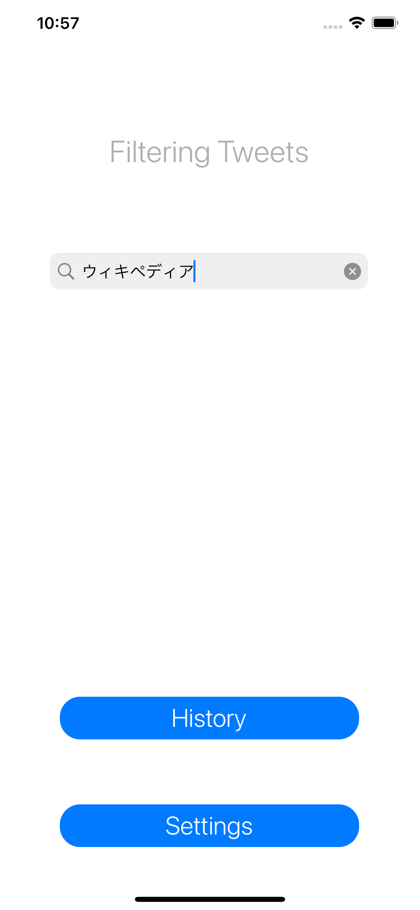
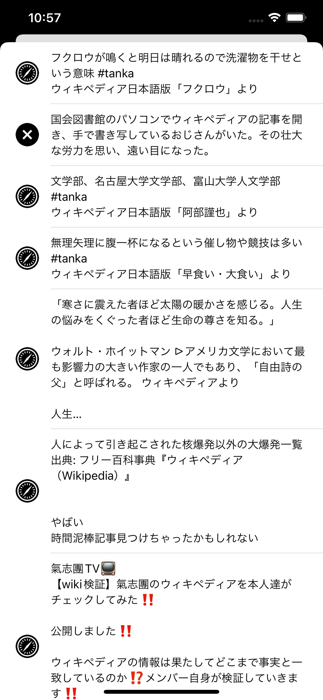
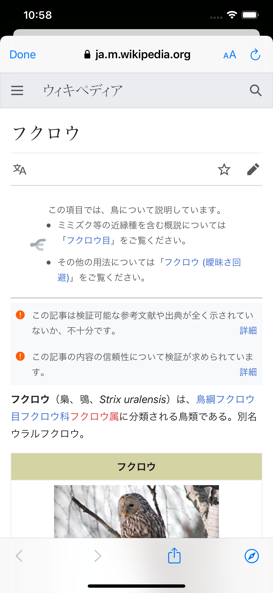

# FilterTwitterApp

## 概要: Description
シンプルなツイート検索アプリです。  
簡単に高度な検索を利用したツイート検索ができます。  
検索結果のセルをタップすると、ツイートに含まれるリンクもしくは画像を表示します。  

This is a simple tweet search application.  
You can easily search tweets using advanced search.  
When you tap on a search result TableViewCell, it will show you the link or image contained in the tweet.  

## デモ: Demo
  

## 環境: Requirement
- macOS Big Sur 11.5.2+
- iOS Deployment Target 14.3+
- Xcode 13.0+
- Swift 5+
- Realm 10.7.4+
- Swifter 2.5.0+

ライブラリ管理にはSwift Package Managerを使用しています。  
Swift Package Manager is used for library management.  

## 注意事項: Note
ツイートの検索にTwitterAPIキーが必要になります。  
TwitterAPIキーは``SerchResultsTableViewController.swift``で使用します。

You will need a TwitterAPI key to search for tweets.  
The Twitter API key is used in ``SearchResultsTableViewController.swift``.

## 文責: Author
[KeachT](https://github.com/KeachT)

## ライセンス: License
The MIT License (MIT)  
https://opensource.org/licenses/mit-license.php
